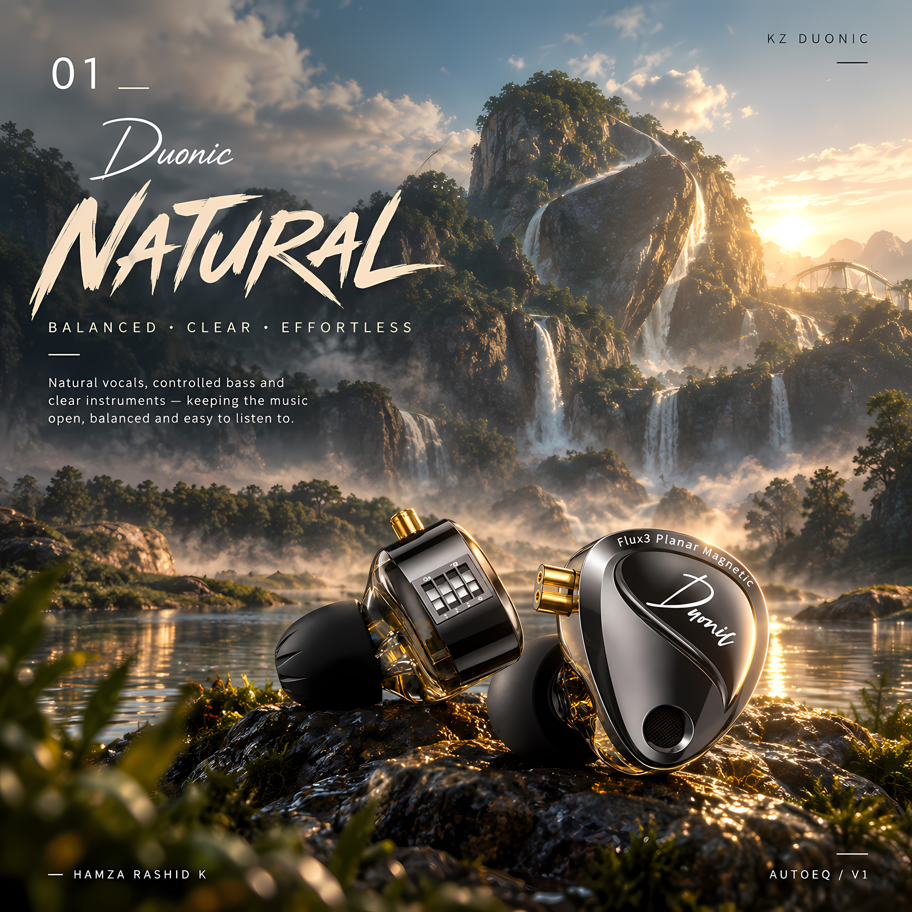
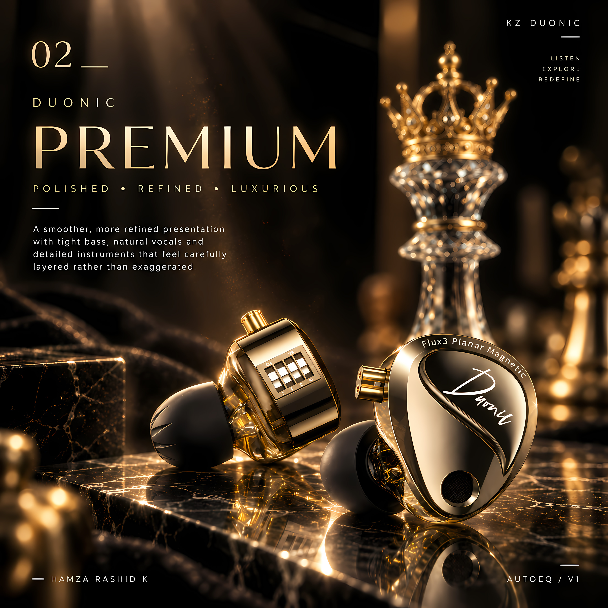
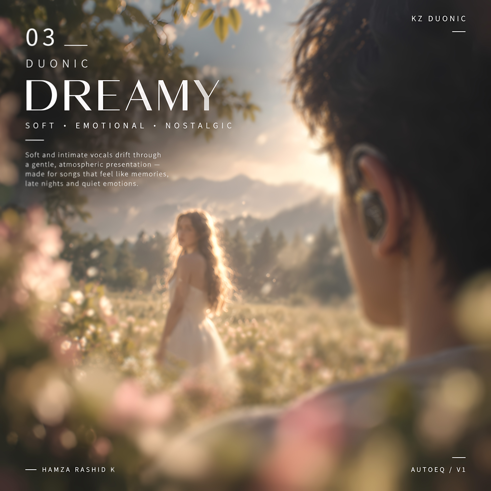
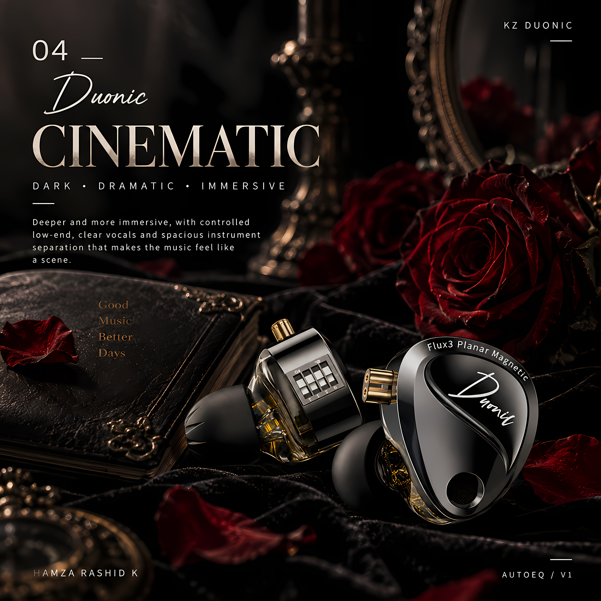
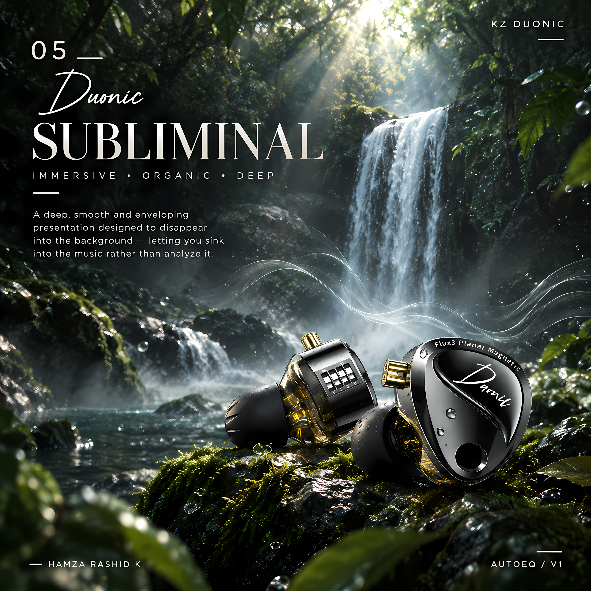
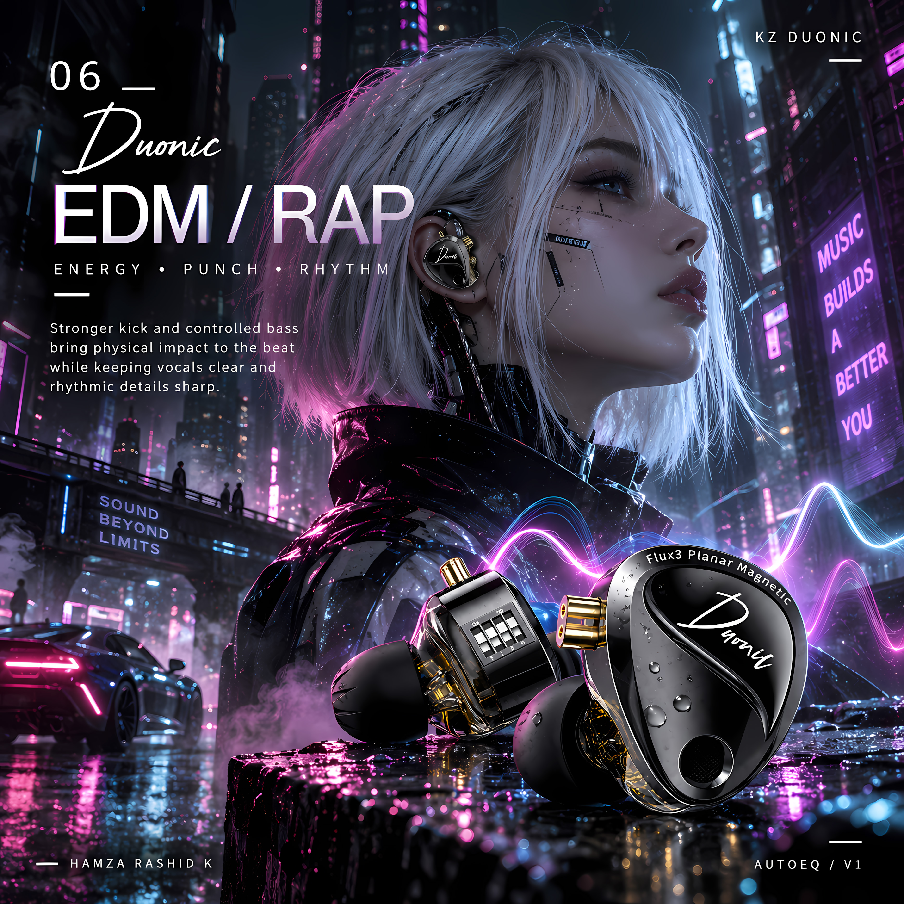

# KZ Duonic AutoEQ — V1

**Experimental EQ profiles and listening-oriented tuning presets for the KZ Duonic IEM.**

Six tuning identities explore different ways the same KZ Duonic can be shaped through equalization: **Natural, Premium, Dreamy, Cinematic, Subliminal, and EDM / Rap**.

> **KZ Duonic AutoEQ · KZ Duonic EQ · KZ Duonic PEQ · KZ Duonic Wavelet · KZ Duonic Poweramp · KZ Duonic DDUD**

## Visual tuning collection

Each visual represents the intended character of its corresponding KZ Duonic EQ profile.

### 01 — Natural



**Balanced · Clear · Effortless**

A balanced everyday profile focused on clear vocals, controlled bass and effortless listening.

[EQ files → Natural](Natural/)

### 02 — Premium



**Polished · Refined · Luxurious**

A polished presentation with refined clarity, controlled low end and a more luxurious overall character.

[EQ files → Premium](Premium/)

### 03 — Dreamy



**Soft · Emotional · Nostalgic**

A softer and more emotional presentation with relaxed energy and a smooth, atmospheric character.

[EQ files → Dreamy](Dreamy/)

### 04 — Cinematic



**Dark · Dramatic · Immersive**

A darker, more immersive profile designed around depth, separation and a dramatic presentation.

[EQ files → Cinematic](Cinematic/)

### 05 — Subliminal



**Immersive · Organic · Deep**

A smooth, relaxed presentation designed to blend into the background and let the music feel natural and enveloping.

[EQ files → Subliminal](Subliminal/)

### 06 — EDM / Rap



**Energy · Punch · Rhythm**

A more energetic profile with controlled bass impact, punch and enough clarity to keep rhythmic details sharp.

[EQ files → EDM / Rap](EDM%20%2B%20Rap/)

## About the project

The goal is not to create one universally “perfect” EQ. Instead, this **KZ Duonic AutoEQ project** explores how different tonal balances can change the character and feeling of the same IEM.

The profiles were developed using frequency-response measurements as a reference, followed by listening-oriented tuning and iteration.

The main focus is:

- reducing unwanted bass masking
- keeping vocals natural and present
- improving instrument clarity and separation
- preserving the Duonic's character
- creating distinct listening identities rather than one generic correction

## Hardware reference

- **IEM:** KZ Duonic
- **Switch configuration:** DDUD
- **Project version:** V1

## Available EQ formats

Every tuning is provided in four formats:

- **Wavelet AutoEQ / GraphicEQ** — fixed 127-point AutoEQ-style format
- **Poweramp PEQ JSON** — parametric EQ preset
- **Universal PEQ** — frequency / gain / Q values for compatible parametric EQ apps
- **General 10-band Graphic EQ** — simple graphic EQ version

This makes the project useful for listeners looking for **KZ Duonic EQ settings**, **KZ Duonic parametric EQ**, **KZ Duonic Wavelet AutoEQ**, or **KZ Duonic Poweramp presets**.

## Tuning identities

| # | Tuning | Character | Best suited to |
|---|---|---|---|
| 01 | **Natural** | Balanced · Clear · Effortless | Everyday listening |
| 02 | **Premium** | Polished · Refined · Luxurious | Detailed, polished listening |
| 03 | **Dreamy** | Soft · Emotional · Nostalgic | Atmospheric and vocal music |
| 04 | **Cinematic** | Dark · Dramatic · Immersive | Soundtracks and immersive listening |
| 05 | **Subliminal** | Immersive · Organic · Deep | Relaxed, background listening |
| 06 | **EDM / Rap** | Energy · Punch · Rhythm | EDM, rap and beat-driven music |

## Project structure

```text
KZ-Duonic/
├── README.md
├── Visuals/
│   ├── Natural.jpg
│   ├── Premium.jpg
│   ├── Dreamy.jpg
│   ├── Cinematic.jpg
│   ├── Subliminal.jpg
│   ├── EDM.jpg
│   └── The Maker.jpg
├── Natural/
├── Premium/
├── Dreamy/
├── Cinematic/
├── Subliminal/
└── EDM + Rap/
```

Each tuning folder contains the four available EQ formats.

## The Maker


This project is an independent audio experimentation exercise by **Hamza Rashid K**, combining measurement references, listening tests, EQ experimentation and visual design.

The aim is to document the process openly and give other KZ Duonic listeners a set of distinct starting points for experimentation.

## Important

These are **V1 experimental/listening presets**, not objective or universal recommendations. The measured frequency response is used as a reference, but perceived sound depends on the listener, fit, source, DAC/amp, ear anatomy and playback chain.

Listening tests and future iterations may change these profiles.

## Search terms

This project is intended to be discoverable for people researching **KZ Duonic AutoEQ**, **KZ Duonic EQ**, **KZ Duonic tuning**, **KZ Duonic PEQ**, **KZ Duonic parametric EQ**, **KZ Duonic Wavelet**, **KZ Duonic Poweramp EQ**, **KZ Duonic DDUD**, and related equalizer presets.

## Version

**V1 — Experimental listening release**

Created by **Hamza Rashid K** as an independent audio experimentation project.
